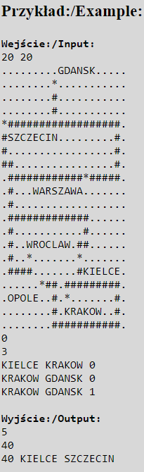

# Description

This project involves implementing a navigation system for a rectangular map divided into squares. Each square on the map can be empty (impassable), part of a road (passable in all directions), or part of a city (passable like a road). The name of each city is given on the map, with each letter occupying one square (letters are impassable). Moving from one square to another takes one minute. Movement is only possible between adjacent squares. Additionally, selected cities are connected by one-way air connections.

    

## Features
- **Map Parsing**: Read and interpret a rectangular map with cities and roads.
- **City Identification**: Recognize and store cities and their locations on the map.
- **Road Navigation**: Calculate the shortest path between cities considering roads.
- **Air Connections**: Integrate one-way air connections between cities with specified travel times.
- **Custom Data Structures**: Implementation of custom string, vector, queue, and priority queue classes to avoid using STL containers.
- **Graph Algorithms**: Utilize graph-based algorithms to determine shortest paths and efficiently manage city connections.

## Implementation Details
- **Custom String Class**: Implements string handling functionality without using the standard string library.
- **Custom Vector Class**: Implements dynamic array functionality.
- **Custom Queue and Priority Queue Classes**: Implements queue operations and priority-based queue operations.

## Input Format
- The first line of input contains the width and height of the map.
- The next h lines each contain w characters representing the map.
- The next line contains the number of air connections k.
- The next k lines each contain the source city, destination city, and travel time.
- The next line contains the number of queries q.
- The next q lines each contain a query in the format: source city, destination city, and query type (0 for time only, 1 for time and path).

## Functions
- `main()`: The entry point of the program. Handles reading the map, adding cities and roads to the graph, processing queries, and printing results.
- `wczytywanie_mapy()`: Reads the map from the input.
- `dodanie_miasta()`: Identifies and stores cities from the map.
- `flood2()`: Performs a flood fill to calculate distances between cities.
- `operacje()`: Processes the air connections and queries.

## Graph Algorithms
The project employs various graph algorithms to manage and process the navigation system:
- **Dijkstra's Algorithm**: Used for finding the shortest paths between cities, taking into account both roads and air connections.
- **Flood Fill Algorithm**: Utilized for initial distance calculations between cities.
